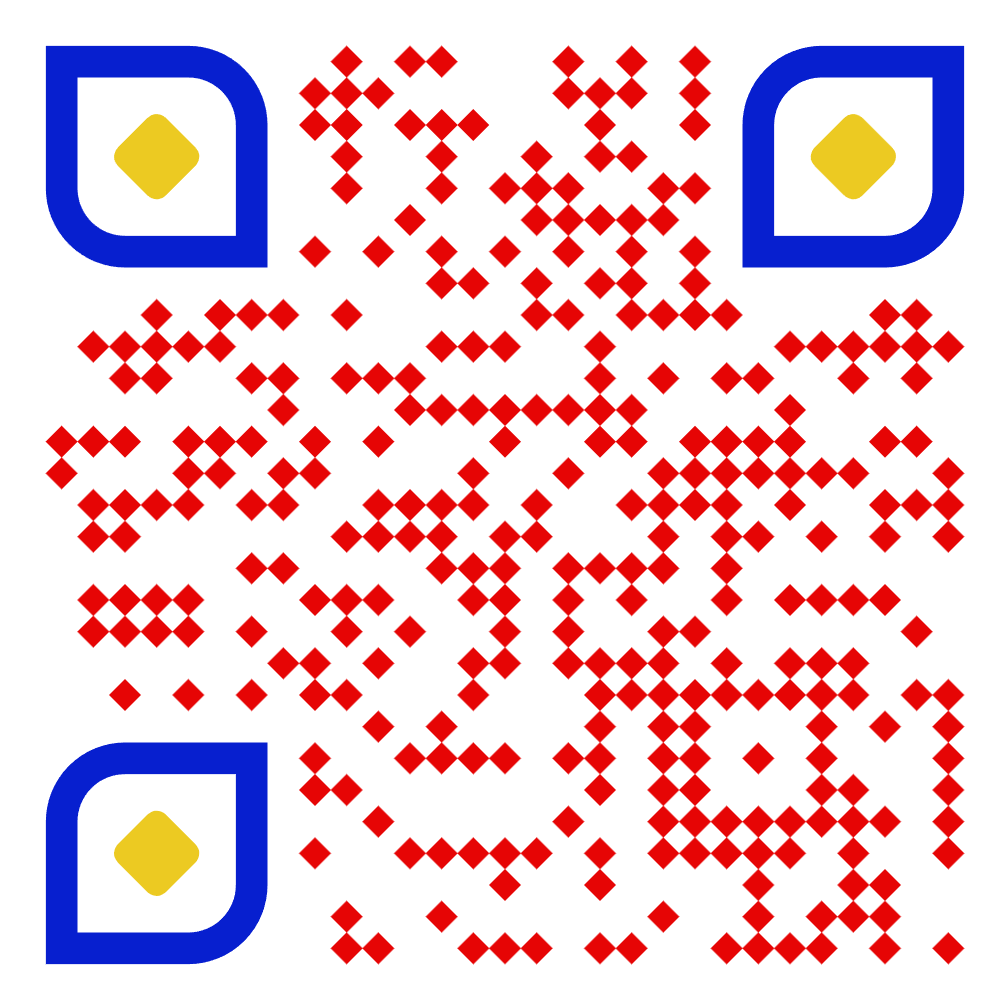

# Sistema de Gestão de Jogadores de Futebol

Este projeto tem como objetivo gerenciar jogadores de futebol, permitindo cadastro, listagem e visualização dos detalhes dos jogadores, consumindo dados de uma API.

## Funcionalidades do Sistema

- **Tela Inicial:** Exibe o logo do time e serve como ponto de entrada do sistema.
- **Tela de Cadastro de Jogador:** Permite cadastrar um novo jogador, informando:
  - Nome
  - Sexo
  - Idade
  - Altura
  - Peso
  - Posição
  - Número da camisa
- **Tela de Lista de Jogadores:** Apresenta todos os jogadores cadastrados e permite visualizar detalhes.

### QR Code :
